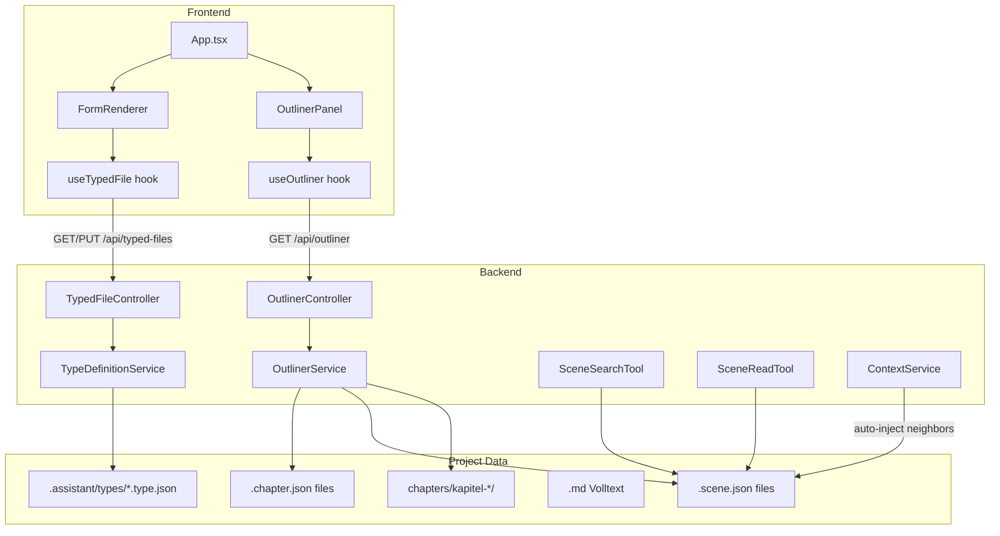
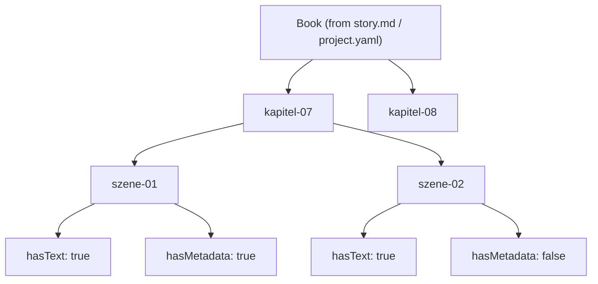

# Project-UI / Outliner Implementation Plan

## Architecture Overview




---

## Phase 1: Type Definition System

The foundation. A `.type.json` file defines which fields a structured file has. All fields are freetext (strings), as discussed.

### Type Definition Schema

Lives in `.assistant/types/`. Example `scene.type.json`:

```json
{
  "id": "scene",
  "name": "Scene",
  "fileExtension": ".scene.json",
  "fields": [
    { "key": "summary", "label": "Zusammenfassung", "type": "text", "hint": "Ein Satz, der die Szene beschreibt" },
    { "key": "voraussetzungen", "label": "Voraussetzungen", "type": "longtext", "hint": "Was muss vor der Szene wahr sein?" },
    { "key": "endzustand", "label": "Endzustand", "type": "longtext" },
    { "key": "plotstraenge", "label": "Plotstränge", "type": "text" },
    { "key": "offene_fragen", "label": "Offene Kausalfragen", "type": "longtext" }
  ],
  "sections": [
    {
      "key": "handlungseinheiten",
      "label": "Handlungseinheiten",
      "repeatable": true,
      "fields": [
        { "key": "titel", "label": "Titel", "type": "text" },
        { "key": "ort", "label": "Ort", "type": "text" },
        { "key": "zeit", "label": "Zeit", "type": "text" },
        { "key": "charaktere", "label": "Charaktere", "type": "text" },
        { "key": "beats", "label": "Beats / Was passiert", "type": "longtext" },
        { "key": "intent", "label": "Intent / Warum", "type": "longtext" },
        { "key": "informationsaenderungen", "label": "Informationsänderungen", "type": "longtext" },
        { "key": "constraints", "label": "Constraints", "type": "longtext" }
      ]
    }
  ]
}
```

Field types are only for rendering hints (`text` = single line, `longtext` = textarea). Both are stored as strings in the data file.

### Backend

- **New:** `TypeDefinitionService` — loads `.type.json` files from `.assistant/types/`, provides schema lookup by `fileExtension`
- **New:** `TypedFileController` — REST endpoints for reading/writing typed files, and retrieving type definitions
  - `GET /api/types` — list all type definitions
  - `GET /api/types/{id}` — get a specific type definition
  - `GET /api/typed-files/content/`** — read a typed file (returns JSON)
  - `PUT /api/typed-files/content/`** — write a typed file (accepts JSON)
- Built-in default type definitions for `scene` and `chapter` ship with the backend (like built-in modes in `resources/types/`), can be overridden per project in `.assistant/types/`

### Frontend

- **New:** `useTypedFile` hook — loads type definition for a file extension, loads/saves file data
- No UI yet in this phase, just the data layer

---

## Phase 2: Outliner Backend

### OutlinerService

Scans `chapters/` and builds a hierarchical tree:




**Logic:**

1. List subdirectories of `chapters/` — each is a chapter
2. For each chapter: check if `.chapter.json` exists
3. For each `.md` file in a chapter dir: check if a matching `.scene.json` exists
4. For each `.scene.json` without a matching `.md`: note as metadata-only
5. Return the tree with completeness status per node

**Data model returned:**

```typescript
interface OutlinerTree {
  chapters: OutlinerChapter[];
}
interface OutlinerChapter {
  path: string;          // "chapters/kapitel-07"
  name: string;          // "kapitel-07"
  hasMetadata: boolean;  // .chapter.json exists
  summary?: string;      // from .chapter.json if exists
  scenes: OutlinerScene[];
}
interface OutlinerScene {
  path: string;          // "chapters/kapitel-07/szene-01"
  name: string;          // "szene-01"
  hasText: boolean;      // .md exists
  hasMetadata: boolean;  // .scene.json exists
  summary?: string;      // from .scene.json if exists
}
```

### OutlinerController

- `GET /api/outliner` — returns the full outliner tree
- `POST /api/outliner/create-chapter` — creates a new chapter folder (+ optional `.chapter.json`)
- `POST /api/outliner/create-scene` — creates a new `.md` and/or `.scene.json` in a chapter

---

## Phase 3: Outliner UI

### OutlinerPanel Component

Replaces or sits alongside the `FileTree` in the left sidebar. Toggle between FileTree and Outliner via tabs or a switch.

**Visual structure:**

- Book title at the top (from `project.yaml` name)
- Expandable chapter nodes, each showing:
  - Chapter name
  - Completeness indicator (color dot or icon)
  - `+` button to create `.chapter.json` if missing
- Under each chapter: scene nodes, each showing:
  - Scene name
  - Two small indicators: text exists / metadata exists
  - `+` button to create missing `.scene.json`
- At chapter level: `+` button to add a new scene
- At root level: `+` button to add a new chapter

**Interactions:**

- Click scene name → opens `.md` in editor (for writing)
- Click scene metadata indicator → opens `.scene.json` in form renderer
- Click chapter metadata indicator → opens `.chapter.json` in form renderer
- Drag scenes to reorder within a chapter (stretch goal)

### useOutliner Hook

- Fetches outliner tree from `GET /api/outliner`
- Tracks active selection (which chapter/scene is focused)
- Provides create actions (chapter, scene, metadata)
- Refresh on file changes

### Integration into App.tsx

- Add sidebar mode toggle: "Files" | "Structure"
- When "Structure" is active, render `OutlinerPanel` instead of `FileTree`
- When a scene/chapter metadata file is opened, render `FormRenderer` instead of `Editor`

---

## Phase 4: Form Renderer

### FormRenderer Component

A generic form that renders any typed file based on its type definition.

**Rendering rules:**

- `text` fields → single-line input
- `longtext` fields → auto-resizing textarea
- `sections` with `repeatable: true` → rendered as a list of fieldsets with add/remove buttons
- Each section instance is a card/block with all its fields

**Behavior:**

- Loads the type definition (from `useTypedFile`)
- Loads current data (or empty if new file)
- Edits update local state
- Save button writes back via `PUT /api/typed-files/content/`**
- Dirty indicator (like the editor has)

**Integration:**

- When `App.tsx` detects that the opened file has a known typed extension (`.scene.json`, `.chapter.json`), it renders `FormRenderer` instead of `Editor`
- The `Editor` panel area becomes context-sensitive: markdown files get CodeMirror, typed files get the form

---

## Phase 5: AI Tools for Scenes

### SceneSearchTool

Follows the exact same pattern as [WikiSearchTool.java](backend/src/main/java/com/assistant/service/tools/WikiSearchTool.java):

- **Name:** `scene_search`
- **Parameters:** `query` (required), `chapter` (optional filter), `limit` (optional)
- **Behavior:** Scans all `.scene.json` files under `chapters/`, matches query against `summary`, character names, plot strand names. Returns compact hit list with path and summary.

### SceneReadTool

Like `WikiReadTool`:

- **Name:** `scene_read`
- **Parameters:** `path` (required, must point to a `.scene.json`)
- **Behavior:** Returns full content of the scene metadata file.

### Context Assembly Changes in ContextService

When the active file is inside `chapters/` (e.g. `chapters/kapitel-07/szene-03.md`):

1. Auto-detect the chapter and scene from the path
2. Auto-include `szene-03.scene.json` (current scene metadata)
3. Auto-include `szene-02.scene.json` and `szene-04.scene.json` (neighbor scene metadata)
4. Auto-include `kapitel-07.chapter.json` (chapter metadata)
5. These go into context **before** tool calls, saving the AI tool rounds

This is a change to [ContextService.java](backend/src/main/java/com/assistant/service/ContextService.java) in the assembly logic.

---

## Phase 6: AI-Assisted Fill (Stretch)

A "KI ausfüllen" button in the `FormRenderer`:

1. Collects current context (active chapter, neighboring scenes, wiki entries)
2. Sends to a dedicated endpoint or uses the chat with a special mode
3. AI returns JSON matching the type schema
4. Form is pre-filled, user reviews and saves

This requires a new mode (e.g. `structure-fill`) with a system prompt that instructs the AI to output valid JSON for the given type definition.

---

## File Changes Summary

### New Backend Files

- `service/TypeDefinitionService.java` — loads type definitions
- `service/OutlinerService.java` — builds outliner tree from chapters/
- `controller/OutlinerController.java` — outliner REST endpoints
- `controller/TypedFileController.java` — typed file CRUD
- `service/tools/SceneSearchTool.java` — scene search for AI
- `service/tools/SceneReadTool.java` — scene read for AI
- `resources/types/scene.type.json` — built-in scene type definition
- `resources/types/chapter.type.json` — built-in chapter type definition

### Modified Backend Files

- [ContextService.java](backend/src/main/java/com/assistant/service/ContextService.java) — auto-inject neighbor scene metadata
- [ProjectConfigService.java](backend/src/main/java/com/assistant/service/ProjectConfigService.java) — copy built-in types on init (like it copies modes)

### New Frontend Files

- `components/OutlinerPanel.tsx` — the outliner tree UI
- `components/FormRenderer.tsx` — generic typed-file form
- `hooks/useOutliner.ts` — outliner state management
- `hooks/useTypedFile.ts` — typed file loading/saving

### Modified Frontend Files

- [App.tsx](frontend/src/App.tsx) — sidebar toggle, conditional editor/form rendering
- [api.ts](frontend/src/api.ts) — new API methods (outliner, typed files, types)
- [types.ts](frontend/src/types.ts) — new types (OutlinerTree, TypeDefinition, etc.)
- [index.css](frontend/src/index.css) — styles for outliner and form renderer

